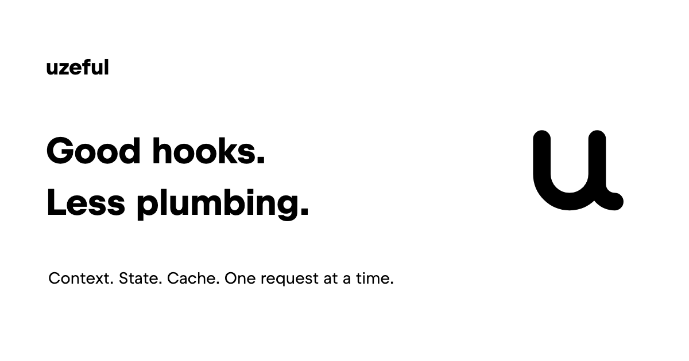

[](https://uzeful.io/)

[](LICENSE)

**Hooks for the backend.** Share typed dependencies, state, and lifecycle hooks within each request, without passing context through every function. Runs on Cloudflare Workers, Bun, and Express.

```bash
npm install uzeful
```

## Your first hook

Use the current request's environment from an ordinary function. This example runs on Bun:

```typescript
import { BunUzefulApp } from "uzeful/bun";

const app = new BunUzefulApp<{ serviceName: string }>();
const uzeContext = app.hooks.uzeContext;

function uzeServiceName() {
  return uzeContext().env.serviceName;
}

Bun.serve({
  fetch: app.fetch(
    async () => Response.json({ service: uzeServiceName() }),
    { getEnv: () => ({ serviceName: "my-api" }) },
  ),
});
```

Each request gets its own context. Call your hooks anywhere inside its handler.

## Why Uzeful?

- **Stop threading context through every layer.** Read the current request, typed bindings, or services from a focused hook.
- **Resolve once per request.** Share state and in-flight service initialization without putting request-owned values in globals.
- **Keep lifecycle work with the feature.** Register response changes, background work, and cleanup from the code that needs them.
- **Test without starting a server.** Supply a test environment and run your hooks inside `app.test`.

Hooks are ordinary functions. Call them conditionally, compose them, and use them across `await` calls. The `uze` prefix signals that a function needs an active Uzeful context.

## Keep going

- [Getting started](https://uzeful.io/) — installation and your first application.
- [Context and hooks](https://uzeful.io/context-and-hooks/) — dependencies, request state, and testing.
- [Caching](https://uzeful.io/caching/) — storage and cache state.
- [Runtime adapters](https://uzeful.io/adapters/) — Cloudflare Workers, Bun, and Express.
